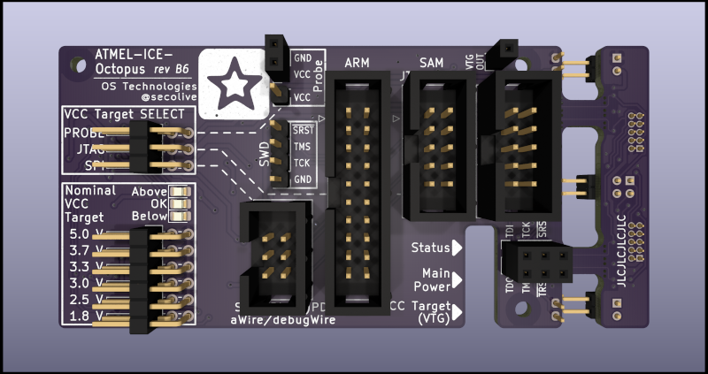
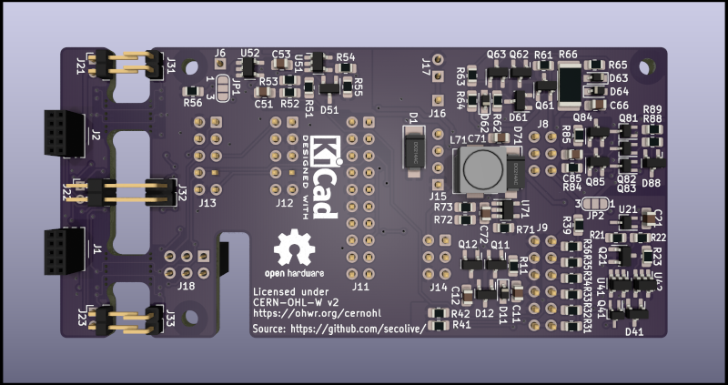
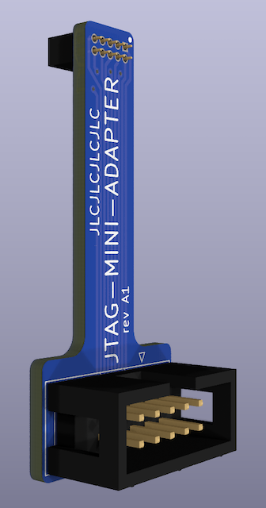
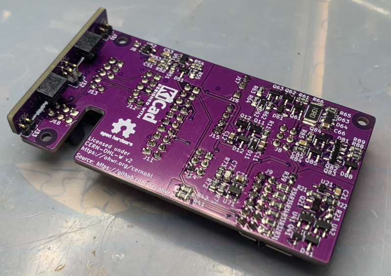
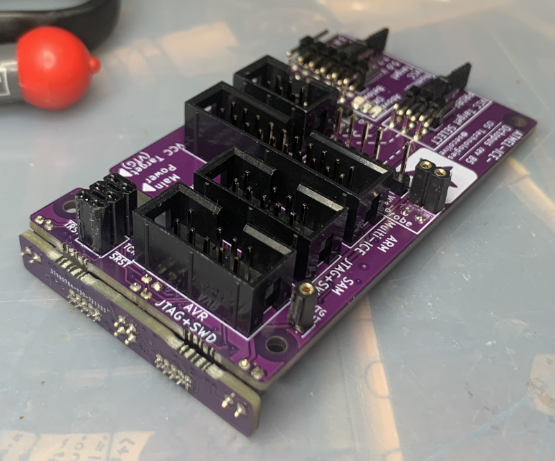
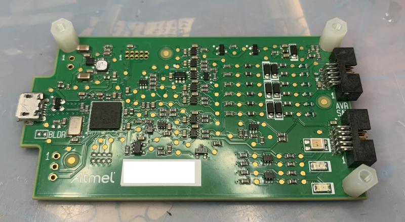
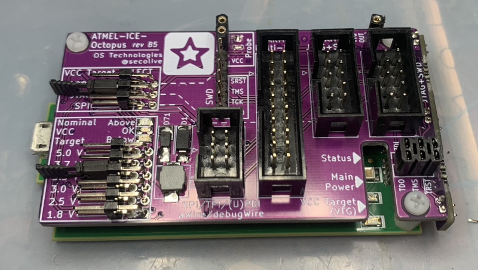
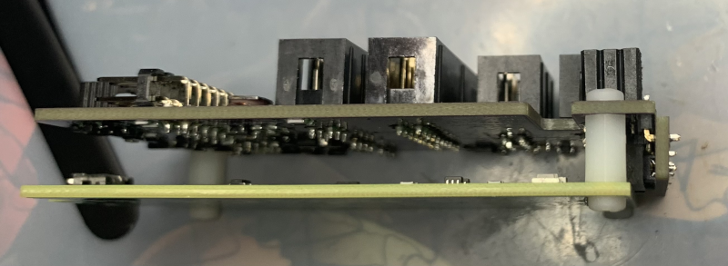
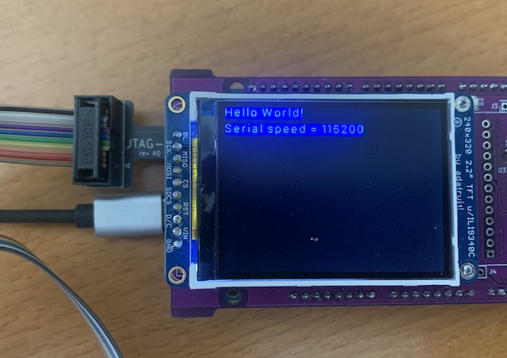

"Octopus" adapter for Atmel-ICE
===============================

Introduction
------------

this project provides KiCad files for the implementation of an adapter board for use with the Atmel-ICE JTAG debugger.
It provides the following features:

- 0.1" headers with standard pinouts
- Specific VCCIO connector for using a probe
- Jumpers to select VCCIO from the appropriate connectors depending on the use case
- VCCIO comparator and limiter for current nominal voltages: 1.8V, 2.5V, 3.0V, 3.3V, 3.7V, 5.0V
- Voltage boosting to power the LEDs when VCCIO voltages below 3.3V are used

### Motivation

The Atmel-ICE provides two 0.05" headers, for which it's unfortunately difficult to get the appropriate cables. Some
versions of the Atmel-ICE come with a "squid" adapter, but are significantly more expensive.

Boards
------

This project contains two different boards that will assemble and work together as a single "product":

- ATMEL-ICE-Octopus: this is the main adapter board, including all circuits implementing VCCIO selection and limiting

  
  

- JTAG-MINI_ADAPTER: 0.1" to 0.05" adapter for standard 10-pin JTAG connectors

  

Connectors
----------

The following connectors are provided by the Octopus:
- J11: 20-pin 0.1" Multi-ICE JTAG header
- J12: 10-pin 0.1" JTAG connector for ARM
- J13: 10-pin 0.1" JTAG connector for Atmel AVR
- J14: 6-pin 0.1" connector for misc AVR protocols: SPI, debugWire, aWire, PDI, UPDI, TPI
- J15: 4-pin 0.1" header matching Arduino's SWD port
- J16: 1-pin 0.1" header to use as VCCIO probe, typically in conjunction with J15 which does not provide any VCCIO;
  note that J15&J16 together work as a 6-pin 0.1" header combining SWD with VCCIO probe
- J17: 2-pin 0.1" socket to be used for adhoc connections
- J18: 6-pin 0.1" socket to be used for adhoc connections
- J6: 1-pin 0.1" socket to be used as a test point for the VTG provided to Atmel-ICE

VCCIO
-----

The Atmel-ICE needs to be fed with the VCCIO corresponding to the board under test, so that it will work at the same
logic level as the CPU being inspected.

To avoid damage to your CPU, it is important that the VCCIO that the Atmel-ICE uses does not exceed the level actually
used by the board. The octopus helps providing safety as follows:

- The reference VCCIO voltage can come from one of three sources, depending on your use case; these sources are: the
  JTAG connectors, the AVR misc connector, and the VCCIO probe. Use the appropriate source depending in your use case
  to ensure that you're using the VCCIO that matches the component you're connecting to.

- Select the appropriate source using the corresponding jumper; common use cases are:
    * when using a JTAG cable: put the jumper in the JTAG position;
    * when using the AVR misc cable, and your board runs on 5.0V: put the jumper in the SPI position;
    * when using the AVR misc cable, and your board runs on something else than 5.0V: put the jumper in the PROBE
      position, and use the PROBE connector in addition to the SPI cable;
    * when using the SWD cable: put the jumper in the PROBE position, and use the PROBE connector in addition to the SPI
      cable.

- You need to further configure the nominal voltage you're expecting to use with your device, using the appropriate
  jumper. The on-board detection logic will use this configuration to decide whether it is safe to propagate the VCCIO
  voltage to the Atmel-ICE VTG input, as follows:
    * if the input VCCIO matches the nominal voltage range, it is send to the Atmel-ICE, and the green "OK" LED will
      be lit;
    * if the input VCCIO is below the nominal voltage range, it is send to the Atmel-ICE nevertheless, but the amber
      "Below" LED will be lit;
    * otherwise, i.e. if the input VCCIO is above the nominal voltage range, no voltage is sent to the Atmel-ICE, because
      it is considered as a fault which could result in using a voltage higher than the expected VCCIO of the target
      device. In this case, the red "Above" LED will be lit.
      

Simplified Variants
-------------------

Depending on your use cases, you might not need all the features of the board; for example, perhaps you  need only the
various 0.1" connectors, but don't care about the voltage limiting. Reducing the feature set enables you to skip some
components and hence reduce the cost. Three features are optional:

- VCCIO monitoring and limiting; this main feature can by bypassed altogether, and the selected VCCIO can be sent
  directly as VTG to the Atmel-ICE. You will then have to ensure that you select the proper VCCIO signal, and that it
  does not exceed the target device voltage.

- Status output of the VCCIO monitoring and limiting; obviously, if you don't perform any monitoring and limiting, you
  won't need any status LEDs. Note that it's technically possible to have some voltage monitoring, without limiting,
  meaning VCCIO will always be sent as VTG to the Atmel-ICE, but the Above/OK/Below LEDs will still indicate whether the
  voltage is in the intended range.

- Voltage boosting to power LEDs when input voltage is below 3.3V. Obviously, if you don't want any status LEDs, you
  don't need any voltage boosting.

Altogether, this means the following variants are possible:

- Variant 1a: VCCIO limiting, monitoring with LEDS, voltage boosting
- Variant 1b: VCCIO limiting, monitoring with LEDS, no voltage boosting
- Variant 2a: VCCIO monitoring with LEDs, no limiting, voltage boosting
- Variant 2b: VCCIO monitoring with LEDs, no limiting, no voltage boosting
- Variant 3: VCCIO limiting, no monitoring, no LEDs
- Variant 4: no VCCIO limiting, no monitoring, no LEDs

The following table describes, for which variant, which components can be skipped, and how to position the solder
jumpers JP1 and JP2.

| Variant | *10-*39       | *40-*49            | *50-*59 | *60-*79 | *80-*89 | JP1 2-3 | JP2 2-3 |
|---------|---------------|--------------------|---------|---------|---------|---------|---------|
| 1a      |               |                    |         |         |         |         |         |
| 1b      |               |                    |         |  skip   |         |         |    X    |
| 2a      | skip Q12, C12 |                    |  skip   |         |         |    X    |         |
| 2b      | skip Q12, C12 |                    |  skip   |  skip   |         |    X    |    X    |
| 3       |               | skip Q41, R41, *42 |         |  skip   |  skip   |         |         |
| 4       | skip          | skip               |  skip   |  skip   |  skip   |    X    |         |

Note that wildcards are used to designate any component with the given number, and when ranges are provided, any
component of any type within the given number range should be skipped. The JP columns indicate when the corresponding
jumper needs to have its pads 2 and 3 bridged.

Regarding JP1 and JP2, note that by default they are always bridged in the 1-2 position. It is not necessary to cut this
traced bridging, as long as the corresponding components are skipped according to the table above.

!! Do not forget to verify the proper jumper settings when adding new components to the board, e.g. in a later stage !!

Assembling
----------

The main board is composed of two different parts; when looking at the front:
- the right-hand side contains the black plate, which is meant to be connected to the Atmel-ICE
- the main part is the squid adapter itself

The back plate can be separated from the main part by breaking off the two break tabs. Connect the back plate to the 
main plate using angled 2mm-pitch headers. 

The assembled octopus adapter can then be plugged atop the Atmel-ICE; both products can be assembled using 8mm-long
spacers using M2.5 threads and screws (plastic recommended), as follows:

On the target device, use the adapter when using a standard Atmel 0.05" header; the adapter is designed to fit an
Arduino Due board and not collide with a shield, as follows:

     