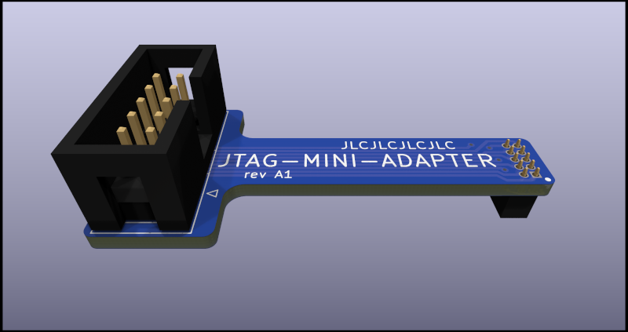

"Octopus" adapter for Atmel-ICE
===============================

Introduction
------------

this project provides KiCad files for the implementation of an adapter board for use with the Atmel-ICE JTAG debugger.
It provides the following features:

- 0.1" headers with standard pinouts
- Individual jumpers to use VCCIO from each header
- Specific VCCIO connector for using a probe
- VCCIO limiter to 3.5V or 5.5V

### Motivation

The Atmel-ICE provides two 0.05" headers, for which it's unfortunately difficult to get the appropriate cables. Some
versions of the Atmel-ICE come with a "squid" adapter, but are significantly more expensive.

Boards
------

This project contains three different boards that will assemble and work together as a single "product":

- ATMEL-ICE-Octopus: this is the main adapter board, including all circuits implementing VCCIO selection and limiting
  
  

- ATMEL-ICE-Octopus-Back: back plate enabling you to connect the octopus in line with the Atmel-ICE
- JTAG-MINI_ADAPTER: 0.1" to 0.05" adapter for standard 10-pin JTAG connectors
  

Connection
----------

When the back plate is mounted on the main board, the Atmel-Ice can be connected in line as follows:

To save cost, you don't need to use the back plate, and use connectors mounted on the main board directly, as follows:

On the target device, use the adapter when using a standard Atmel 0.05" header; the adapter is designed to fit an
Arduino Due board and not collide with a shield, as follows:

**!Beware!** depending on the actual connectors mounted on the octopus, it is possible to shift the connections by a pin
up or down (i.e. by 0.05"). Make sure the connectors from the Octopus are properly centered in the Atmel-ICE headers.

VCCIO
-----

The Atmel-ICE needs to be fed with the VCCIO corresponding to the board under test, so that it will work at the same
logic level as the CPU being inspected.

To avoid damage to your CPU, it is important that the VCCIO that the Atmel-ICE uses does not exceed the level actually
used by the board. The octopus helps providing safety as follows

- for each connector (Atmel-ICE, ARM JTAG, AVR JTAG and SPI), there is a corresponding jumper that needs to be set to
  use the VCC voltage from the connector as VCCIO for the Atmel-ICE. Typically, when using the SPI connector, the jumper
  should not be set.
- there is also a "VCCIO Probe" connector which can be used to get the proper voltage from another place of the target
  board (using e.g. breadboard). This probe will take precedence over any voltage coming from the headers.
- there is an on-board voltage limiter which will actually transport the configured VCC level to the Atmel-ICE only if
  it is below a limit voltage of 3.5V or 5.5V; the actual limiter value can be configured using the corresponding
  jumper. The limiter can also be bypassed altogether using the "Limiter bypass" jumpers.

A set of LEDs will help you understand what happens with the VCC that was configured :

- VCCIO Probe - Using: when lit, means the voltage from the VCCIO probe is fed to Atmel-ICE
- VCCIO Probe - Over: when lit, means there is actual voltage from the VCCIO probe, but this voltage is higher than the
  limit value, hence no voltage is provided to Atmel-ICE
- VCCIO In - Using: when lit, means the voltage from the header in use is fed to Atmel-ICE ; it also implies that no
  voltage is present on VCCIO Probe.
- VCCIO In - Over: when lit, means there is actual voltage from the header in use, but this voltage is higher than
  the limit value, hence no voltage is provided to Atmel-ICE

When no LED is lit, this means that no VCC is seen on the connectors in use (or the corresponding jumpers are not set).